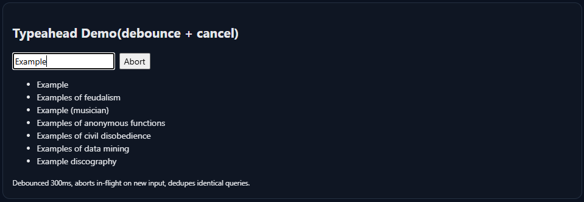
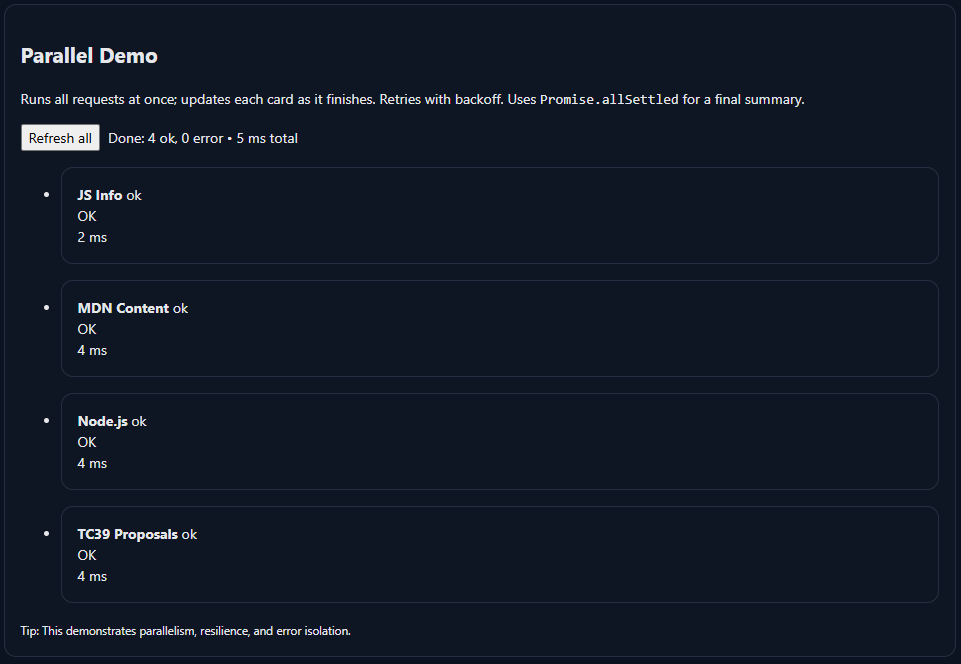
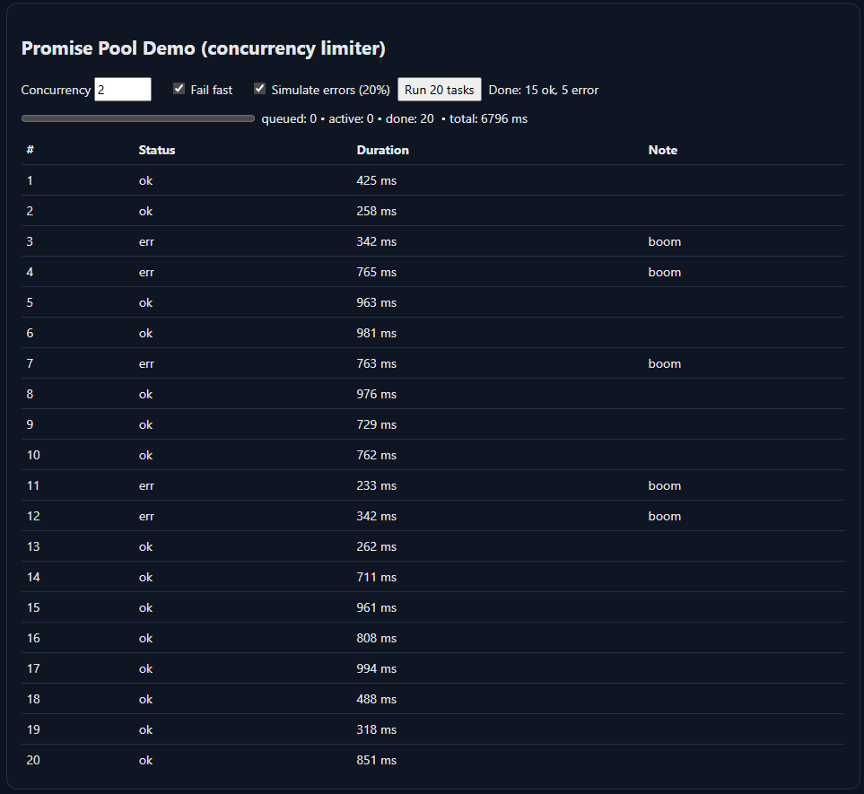
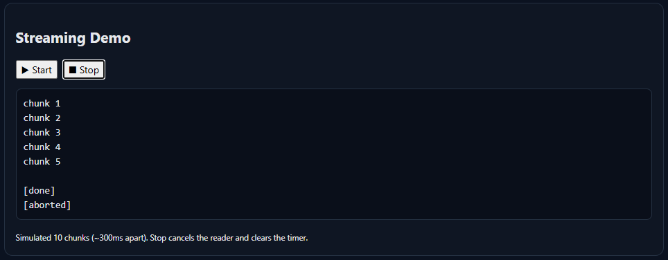
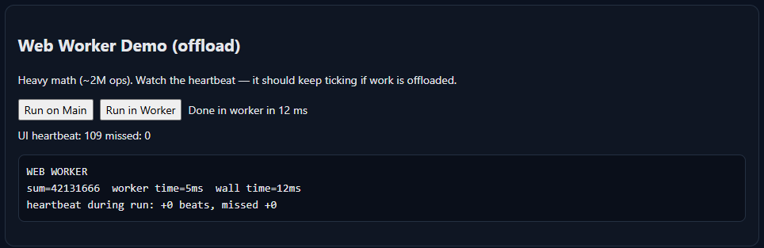
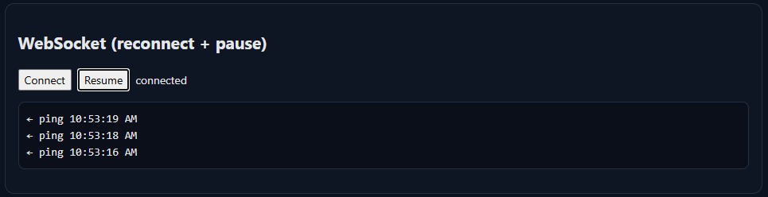

# ⚡ Async Control Room (Vanilla JavaScript)

A showcase web app built with **pure JavaScript** to demonstrate mastery of modern asynchronous programming:  
**Promises, async/await, AbortController, retries, concurrency limits, streaming, workers, and WebSockets.**

_No frameworks. No dependencies. Just browser APIs._

---

## 🌟 Why this project?

Modern frontends live and die by async behavior. This project demonstrates not only that you can use `async/await`, but that you deeply understand **real-world async patterns**:

- 🔁 Debouncing and request cancellation
- ♻️ Retrying with exponential backoff + jitter
- 📦 In-flight request deduplication
- ⚡ Parallel fetching with error boundaries
- 📊 Promise pools with concurrency limits
- 🌊 Streams API for incremental chunk handling
- 🧵 Web Workers for CPU offloading
- 📡 WebSockets with reconnect and buffering

---

## 🚀 Modules Overview

### 🔍 Typeahead Search (Debounce + Cancel + Race Control)

- Debounced input queries Wikipedia API
- Aborts in-flight requests with **AbortController**
- Ignores late responses (race condition safe)
- Dedupes identical inflight requests



---

### 🌐 Parallel Dashboard (Promise.allSettled + Retry)

- Fetches multiple GitHub repos in parallel
- Uses **Promise.allSettled** for partial results
- Implements **fetchWithRetry** with backoff + jitter
- Gracefully displays both results and errors



---

### 📊 Promise Pool Demo (Concurrency Limiter)

- Runs 20 simulated tasks with configurable concurrency
- Generic **promisePool** utility
- Live progress reporting (done/active/total)
- Demonstrates resource control and backpressure handling



---

### 🌊 Streaming Demo (ReadableStream)

- Reads chunked text from a simulated stream
- Displays data incrementally as it arrives
- Supports **abort** via AbortController



---

### 🧵 Worker Demo (Web Workers)

- Offloads CPU-heavy math from main thread
- Compares runtime vs worker execution
- Demonstrates keeping UI responsive under load



---

### 🔄 WebSocket Demo (Reconnect + Pause Buffering)

- Connects to a live WebSocket echo server
- Automatic **reconnect with exponential backoff**
- **Pause/Resume** button buffers messages
- Live ticker feed (pings every 1.5s)



---

## 🛠️ Tech Stack

- **Vanilla JavaScript ES Modules**
- Browser APIs:  
  `fetch`, `AbortController`, `Promise.allSettled`,  
  `ReadableStream`, `Web Worker`, `WebSocket`
- Simple HTML + CSS (no frameworks)

---

## ⚙️ Getting Started

Clone the repo and run it locally with any static server.  
For example, using [`live-server`](https://www.npmjs.com/package/live-server):

```bash
npm install -g live-server
live-server
```
